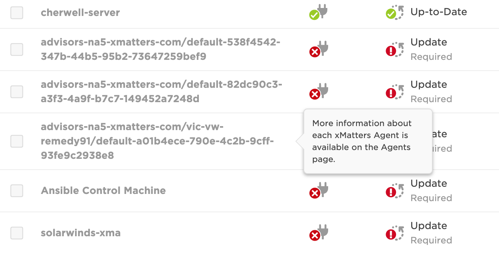
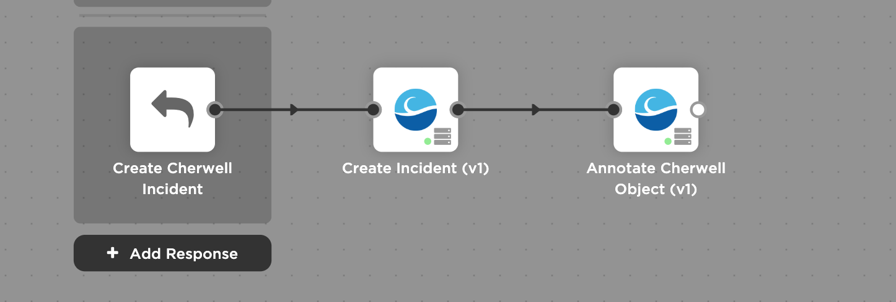
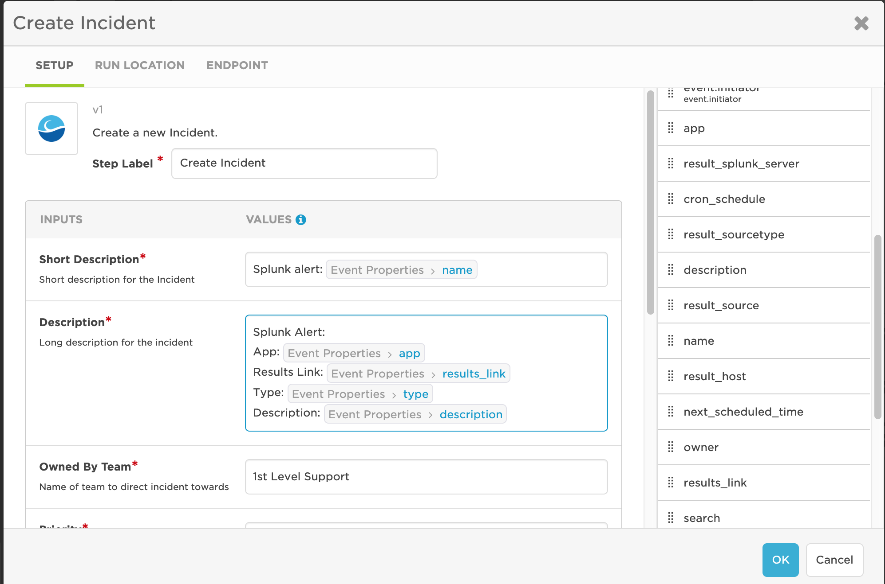
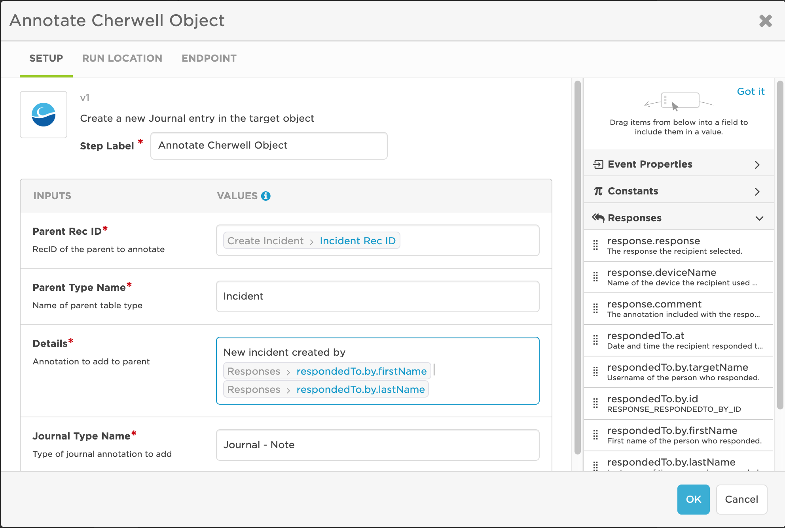

# xMatters ---> Cherwell Integration
This is part of the xMatters Labs Steps awesome listing. For others, see [here](https://github.com/xmatters/xMatters-Labs-Flow-Steps).

With this library, you can quickly create and annotate incidents (or any object) from any Flow inside xMatters.

This document details how to install and use these steps. 

---------

<kbd>

</kbd>

---------
# Pre-Requisites
* xMatters account - If you don't have one, [get one](https://www.xmatters.com)! 
* Cherwell server

# Files
* [Cherwell.zip](./Cherwell.zip) - This is the Communication that holds the Cherwell steps
* [create-incident.js](./create-incident.js) - This is the script inside the `Create Incident` step
* [annotate-object.js](./annotate-object.js) - This is the script inside the `Annotate Object` step

# Introduction - How it works
Cherwell is a powerful incident management application that allows for complex business logic without code. This integration adds capability to any xMatters integration to open new Incidents and to add annotations to Incidents or other objects in Cherwell.

# Installation

## Cherwell Setup
1. Open CSM Admin (orange pill), navigate to **Security** > **Edit REST API client settings** 
2. Click **Create new client**, then give the client a name and save the Client Key for use later in the endpoint

## xMatters Setup
1. Download the [Cherwell.zip](./Cherwell.zip) file onto your local computer
2. Navigate to the Developer tab of your xMatters instance
3. Click **Import Plan**, and select the zip file you just downloaded

## Usage
Note: To use the Cherwell actions, you must have a Cherwell server with an exposed endpoint, or with the xMatters agent installed. For instructions on installing the xMatters agent, [see here](https://help.xmatters.com/ondemand/xmodwelcome/xmattersagent/xmatters-agent-topic.htm)

### Create Incident Step
Note: It may be in your interest to create a Constant for the Customer ID in the Integration Builder so you can drag in the Customer ID from the constants rather than pasting the value each time you want to use the step.
1. To use the Create Incident Step, click and drag it into the flow, then double click the step to edit it
2. In the **Setup** tab, fill out or drag in the required inputs - `Short Description`, `Description`, `Owned By Team`, `Priority`, and `Customer ID`
3. In the **Run Location** tab, leave it on `Cloud` if you have an exposed endpoint, or change it to `xMatters agent` if you installed the agent, then select the Cherwell server
4. In the **Endpoint** tab, click `Create Endpoint`, and fill it out with the following values

### Annotate Object Step
1. To use the Annotate Object Step, click and drag it into the flow, then double click the step to edit it
2. In the **Setup** tab, fill out or drag in the required inputs - `Parent Rec ID`, `Parent Type Name`, and `Details`
3. In the **Run Location** tab, leave it on `Cloud` if you have an exposed endpoint, or change it to `xMatters agent` if you installed the agent, then select the Cherwell server
4. In the **Endpoint** tab, click `Create Endpoint`, and fill it out with the following values

| Key | Value |
| --- | --- |
| Name | Cherwell |
| Base URL | `Cherwell Base URL` |
| Authentication Type | OAuth2 |
| Grant Type | Password |
| Access Token URL | `Cherwell Base URL`/CherwellApi/token |
| Username | `Cherwell Username` |
| Password | `Cherwell Password` |
| Client ID | `Cherwell Client ID` |
* `Cherwell Base URL` will be http://localhost if you have installed the xMatters agent, or whatever exposed URL you have if not
* `Cherwell Username` and `Cherwell Password` are your username and password
* `Cherwell Client ID` is the client id you created in [Cherwell Setup](#cherwell-setup)

# Example Usage:

This is showing the Create Incident being triggered from a response. 

<kbd>
	
</kbd>

Editing the step shows details of the input mapping:

<kbd>
	
</kbd>

The Annotate step requires the Incident Rec ID so that the journal entry can be associated to a parent record. 
<kbd>
	
</kbd>